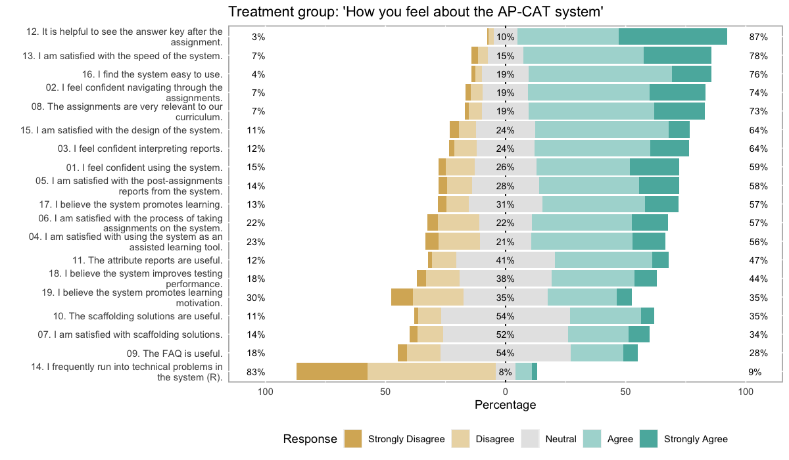
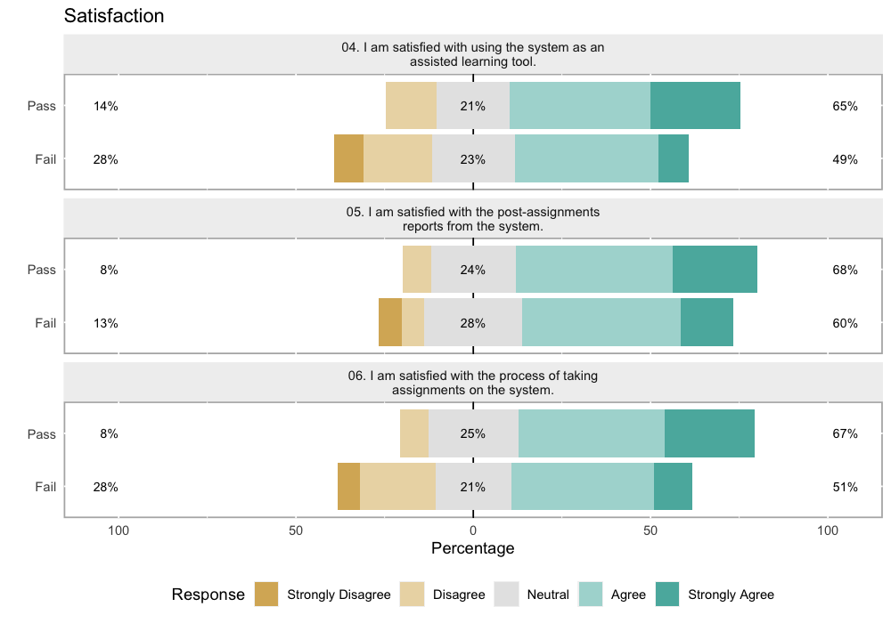
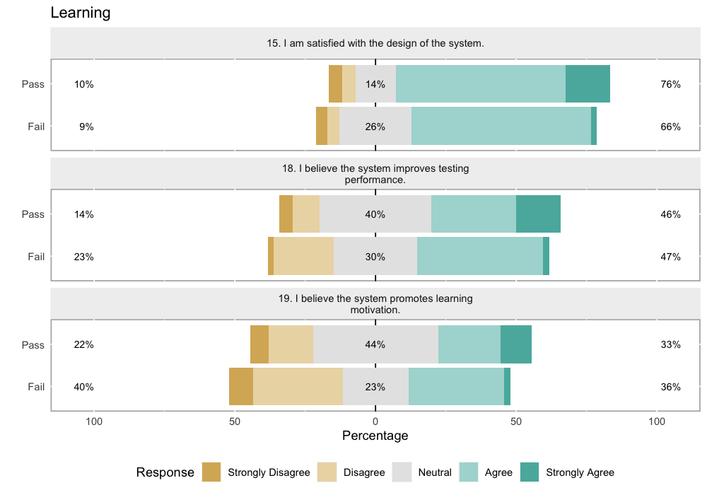

# UX Survey Report

A user experience survey was developed and applied to students using the assessment system in the 2018-19 school year. A total of 423 students were surveyed from statistics classes throughout the school year. 

For analyses script, please see (survey3-demo.R)[survey3-demo.R].

## System Features

In order to evaluate the system features, students were assigned to either a _treatment_ or a _control_ group. The treatment group had access to all system features: final score for each assessment, scaffolding (step-by-step solutions), assessment reports with answer keys, and attribute reports with "Novice", "Intermediary", and "Expert" assigned to each skill. The control group only had access to their scores on the assessments.

## The UX Survey

Among a number of surveys, a User Experience was developed and assigned to each student asking about their satisfaction with the system navigation, usability, and reliability, and their perception of the content relevance and motivation for learning. All items were given on a 5-point scale from "Strongly Disagree" to "Strongly Agree", except for two free-response items, where students were able to type in an answer. A summary of the items is given below:

| Domain | \# | Item |
|:---|---:|:--|
|*System Usability* |  1  | "I feel confident using the   system."                                     |
| | 2  | "I feel confident navigating through the assignments."                     |
| | 3  | "I feel confident interpreting reports."                                   |
|  | 4  | "I am satisfied with using the system as an assisted learning   tool."     |
| | 5  |  "I am satisfied with the   post-assignments reports from the system."     |
|| 6  | "I am satisfied with the process of taking assignments on the   system."   |
|| 12 |            "It is helpful to   see the answer key after the assignment."   |
|| 13 |            "I am satisfied   with the speed of the system."                |
|| 14 |            "I frequently run   into technical problems in the system (R)." |
| | 16 |            "I find the system   easy to use."                              |
| *Learning*|   7  |            "I am satisfied   with scaffolding solutions."                  |
| | 8  |            "The assignments   are very relevant to our curriculum."        |
|| 9  |            "The FAQ is   useful."                                          |
|| 10 |            "The scaffolding   solutions are useful."                       |
|| 11 |            "The attribute   reports are useful."                           |
|| 15 |            "I am satisfied   with the design of the system."               |
|| 17 |            "I believe the   system promotes learning."                     |
|| 18 |            "I believe the   system improves testing performance."          |
|| 19 |            "I believe the   system promotes learning motivation."          |

## Data Pre-processing

A total of 235 students were given the userx survey. Of the total, 36 students did not answer the survey, and 19 were removed due to unreliable responses (long string of the same answer category). After removal of the data, a sample of $N=180$ students were used for these analyses. 

Finally, the data was changed from numerical (1,2,3,4,5) to categorical values ("Strongly Disagree", "Disagree", "Neutral", "Agree", "Strongly Agree"). One reverse-coded item was present, but kept at the original scale for the purposes of data visualization.

## 1. Are students in the treatment group satisfied with the system?

Using the `likert` package and a centered layout, we can plot response frequencies per category:

### Main results

- :white_check_mark: [# 12] _Answer keys_ are helpful (87\% selected "Agree" or "Strongly agree")
- :white_check_mark: [# 13, 16] System is _easy to use_ and _fast_ (76-78\% selected "Agree" or "Strongly agree")
- :white_check_mark: [# 8] Assessments are _very relevant_ to their curriculum (73\% selected "Agree" or "Strongly agree")
- :x: [# 11] _Attribute reports_ are not as helpful as expected (about 53\% of students selected "Neutral" or worse)
- :x: [# 7, 9] Students are either unfamiliar or dissatisfied with _FAQ_ and _scaffolding_ solutions (about 2/3 of students selected "Neutral" or worse)

### Results explained

The most striking pattern is of the "Neutral" category, which can be interpreted as students feeling ambivalent about those specific features.

For example, 55\% of the students marked "Neutral" for item _9. The FAQ is useful_ and _10. The scaffolding solutions are useful_. This indicates potentially two things: the FAQ is not particularly helpful (at the time of the survey, there were only a couple questions in the FAQ), and students did not find the step-by-step solutions useful OR they did not understand what the "scaffolding" solutions are, even if they have taken advantage of it. Such language was commonly used within the system research team, but would not be necessarily used in the classroom. Furthermore, the team wonders whether students did not use the "Scaffolding" button because they did not understand what it meant.

### Actionable items

- Improve visual aspects of Attributes Report; interview a small group of students to learn what they would like to see on the report;
- Change button from "Scaffolding" to "Step-by-step Solutions";
- Add more information to the FAQ based on the students' input from to the free-response questions.

## 2. Is there a difference in satisfaction for students who passed the AP exam vs. those who didn't?

At the end of the school year the students took the AP statistics exam, and their scores (1-5) were reported. Students were considered to "Pass" they scored 4 or 5, and to "Fail" otherwise. We now evaluate how students in the *treatment group* compared in their satisfaction given AP exam scores.

Below we see two figures regarding their satisfaction with the system and their learning process.

### Factor 1: Satisfaction with the System

Students in the "Fail" group do not seem to be as satisfied as the "Pass" group when it comes to using the system as an assisted learning tool (#4) and with the process of taking assessments in the system (#6), since 28\% marked "Disagree" or "Strongly Disagree" for those items, compared to only 14\% and 8\%, respectively, for students in the "Pass" group. This indicates that students who feel like they benefit from the system are more likely to perform well on the AP exam.

Although the statistical test comparing total scores on the System Satisfaction factor across Pass/Fail groups did not show significant difference between the two groups (p > .05), the estimate had high variability (due to a relatively small sample size) and system satisfaction could still be a predictor of good performance on the AP exam. This hypothesis requires further investigation. 

### Factor 2: Learning Motivation

When it comes to learning motivation (#19), students in the Fail group selected "Disagree" or "Strongly Disagree" 40\% of the time compared to 22\% in the Pass group. Thus many students in the Fail group did not feel the system promoted learning motivation as much as we had hoped. 

Along with previous results from the first research question, improving the step-by-step solutions and attribute reports may help increase students motivation and potentially their performance on the AP exam.
